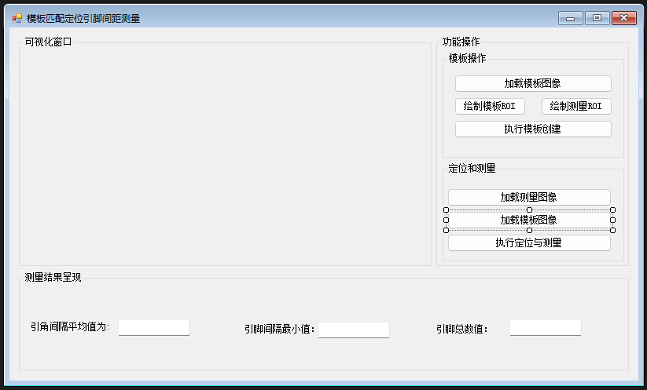
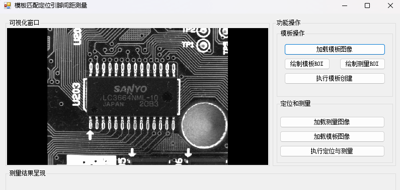
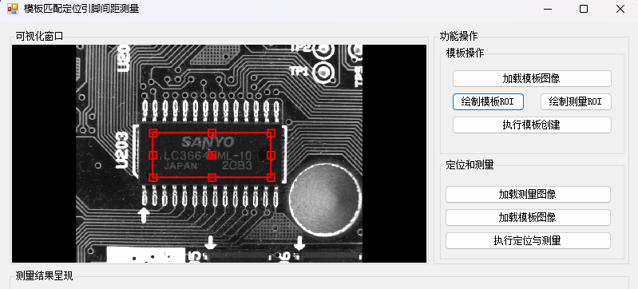
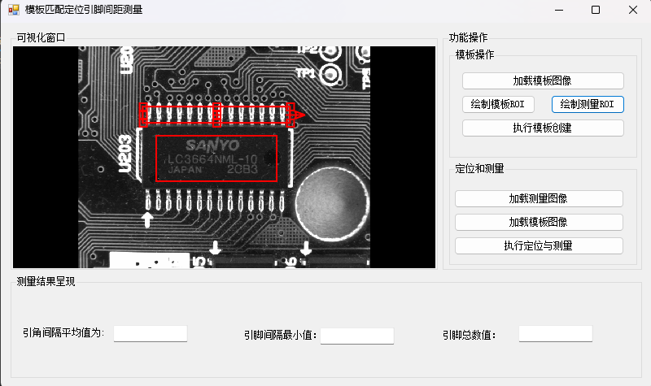
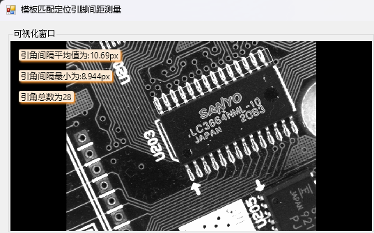

# C-HalconMatching
使用C# + winform实现模板匹配和定位引脚间距测量
# 一、搭建界面
  
1.实现可视化窗口，展示图像处理操作效果  
2.加载模板图像  
3.绘制模板ROI  
4.执行模板创建  
5.加载测量图像  
6.加载模板图像  
7.执行定位与测量  
8.显示测量结果  

# 二、实现功能
1.实现可视化窗口，展示图像处理操作效果  
```
//创建一个halcon控件对象
hwControl = new HSmartWindowControl();
//设置控件以填充方式放入到父容器中
hwControl.Dock = DockStyle.Fill;
//添加到对应容器中
panel1.Controls.Add(hwControl);
```  

2.加载模板图像  
```
//创建一个资源对话框对象
var dialog = new OpenFileDialog();
dialog.Filter = "选择模板图像|*.png";
if (dialog.ShowDialog() == DialogResult.OK)
{
    //获取对话框中选择的资源路径
    var filePath = dialog.FileName;
    //通过路径创建一个Halcon图像对象
    ho_Image = new HImage(filePath);
    //把图像显示到halcon窗口上
    hwControl.HalconWindow.DispObj(ho_Image);

    //设置让其图像适应容器大小（等比例缩放不失真）
    hwControl.SetFullImagePart();
}
```
  
  
3.绘制模板ROI  
```
//提供绘制ROI的数据数组
var roiData = new HTuple[] { 100,150,150,250 };
//创建矩形ROI对象
var rectROI = HDrawingObject.CreateDrawingObject(HDrawingObject.HDrawingObjectType.RECTANGLE1, roiData);
//注册ROI对象的拖拽及缩放事件
rectROI.OnDrag(Rect1OnDragAction);
rectROI.OnResize(Rect1OnResizeAction);

//把绘制ROI对象、数据，ROI类型保存起来
drawingObjectExs.Add(new DrawingObjectEx
{
    DrawingObject = rectROI,
    DrawingObjectDatas = roiData,
    DrawingObjectType = HDrawingObject.HDrawingObjectType.RECTANGLE1

});
//把创建ROI附加到halcon窗口中显示
hwControl.HalconWindow.AttachDrawingObjectToWindow(rectROI);
```  

4.执行模板创建  
```
//判断模板ROI是否绘制
if(drawingObjectExs.Count == 0)
{
    MessageBox.Show("请先绘制模板ROI后再绘制测量ROI");
    return;
}

//提供绘制ROI的数据数组
var roiData = new HTuple[] { 200, 350 , 0, 163, 7 };
//创建矩形ROI对象
var rectROI = HDrawingObject.CreateDrawingObject(HDrawingObject.HDrawingObjectType.RECTANGLE2, roiData);
//注册ROI对象的拖拽及缩放事件
rectROI.OnDrag(Rect2OnDragAction);
rectROI.OnResize(Rect2OnResizeAction);

//把绘制ROI对象、数据，ROI类型保存起来
drawingObjectExs.Add(new DrawingObjectEx
{
    DrawingObject = rectROI,
    DrawingObjectDatas = roiData,
    DrawingObjectType = HDrawingObject.HDrawingObjectType.RECTANGLE2
});
//把创建ROI附加到halcon窗口中显示
hwControl.HalconWindow.AttachDrawingObjectToWindow(rectROI);

/// <summary>
/// 更新ROI数据的方法
/// </summary>
/// <param name="drawid"></param>
/// <param name="v"></param>
private void UpdateROIData(HDrawingObject drawid, int index)
{
    //获取需要处理的ROI对象
    var roi = drawingObjectExs[index];
    //获取ROI类型
    var roiType = roi.DrawingObjectType;
    
    HTuple[] valueArray = null;
    switch (roiType)
    {
        case HDrawingObject.HDrawingObjectType.RECTANGLE1:
            //定义矩形的参数名称对象
            var nameTuple = new HTuple("row1", "column1", "row2", "column2");
            //获取对应参数名称组成数据元组
            var valueTuple = drawid.GetDrawingObjectParams(nameTuple);
            //组织对应数据数组
            valueArray = new HTuple[] { valueTuple[0], valueTuple[1], valueTuple[2], valueTuple[3] };
            break;
        case HDrawingObject.HDrawingObjectType.RECTANGLE2:

            //定义矩形的参数名称对象
            nameTuple = new HTuple("row", "column", "phi", "length1", "length2");
            //获取对应参数名称组成数据元组
            valueTuple = drawid.GetDrawingObjectParams(nameTuple);
            //组织对应数据数组
            valueArray = new HTuple[] { valueTuple[0], valueTuple[1], valueTuple[2], valueTuple[3], valueTuple[4] };
            break;
    }
    //更新ROI对象
    roi.DrawingObjectDatas = valueArray;


}
```

5.加载测量图像  
6.加载模板图像  
7.执行定位与测量  
